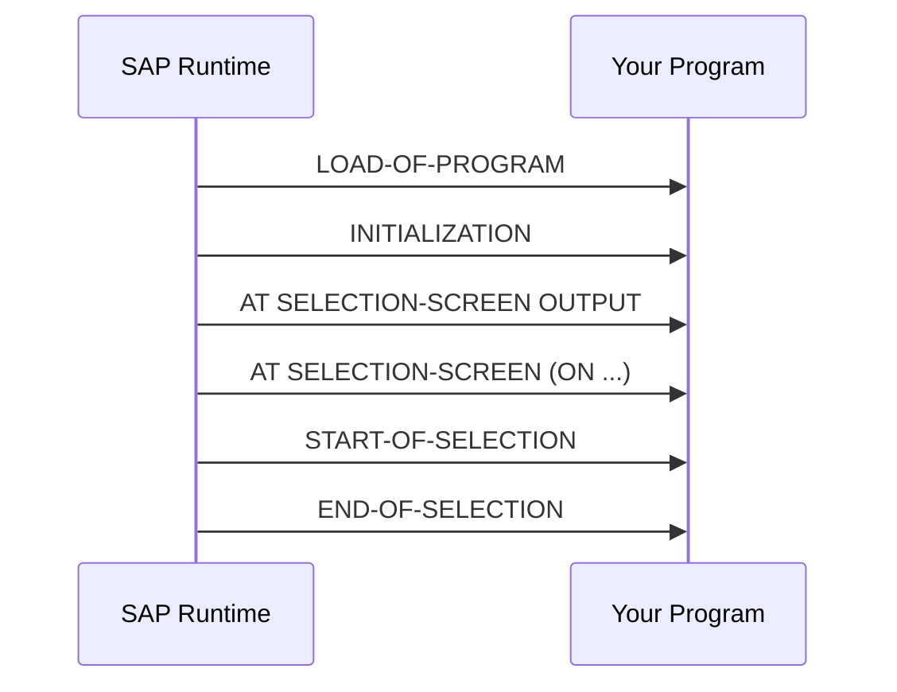

# 01 — ABAP Basics

## 📖 Introduction

Every ABAP program (report, class pool, or function pool) is built from a set of well-known **building blocks**: declarations, processing blocks (events), and statements. This chapter covers the skeleton of a classic ABAP report and the fundamental syntax you will see everywhere else in this guide.

> This chapter intentionally keeps a **global class + event blocks** structure, since that is the most common real-world pattern for OOP-based reports (see [13-ALV](../13-ALV/README.md) for the full example this snippet is taken from).

## 🧱 Anatomy of an ABAP Program

| Block | Keyword | Purpose |
|---|---|---|
| Header | `REPORT` / `PROGRAM` | Declares the program name |
| Global declarations | `DATA`, `CLASS ... DEFINITION` | Data and class definitions valid for the whole program |
| Event blocks | `INITIALIZATION`, `START-OF-SELECTION`, `AT SELECTION-SCREEN`, `END-OF-SELECTION` | Control the flow of a classical report |
| Implementation | `CLASS ... IMPLEMENTATION` | Method bodies |

## 🧪 Example — Program Header & Global Declarations

```abap
"----------------------------------------------------------------------
" Report  : ZSM_R_DELIVERY_MONITOR
" Purpose : Displays open deliveries per plant for the daily review.
"           Read-only; no document is changed here.
" Ref     : <business requirement / ticket>
"----------------------------------------------------------------------
CLASS lcl_main DEFINITION DEFERRED.

DATA go_container     TYPE REF TO cl_gui_custom_container.
DATA go_document      TYPE REF TO cl_dd_document.
DATA go_main          TYPE REF TO lcl_main.
DATA go_grid          TYPE REF TO cl_gui_alv_grid.
DATA go_splitter      TYPE REF TO cl_gui_splitter_container.
DATA go_subcontainer1 TYPE REF TO cl_gui_container.
DATA go_subcontainer2 TYPE REF TO cl_gui_container.
DATA gt_out           TYPE TABLE OF zsm_s_delivery.

INITIALIZATION.
  go_main = NEW #( ).

START-OF-SELECTION.
  go_main->start_of_selection( ).
```

> 📝 **Note:** `CLASS lcl_main DEFINITION DEFERRED.` is used so that the class name can be referenced (e.g., in `TYPE REF TO`) **before** its full definition appears later in the program — a common forward-declaration pattern in local classes.

## 🔄 Classical Report Event Flow



| Event | When It Fires |
|---|---|
| `INITIALIZATION` | Before the selection screen is displayed; good place to set default values |
| `AT SELECTION-SCREEN OUTPUT` | Right before the screen is rendered (used to modify screen attributes) |
| `AT SELECTION-SCREEN ON <field>` | After user input, for validating a specific field |
| `START-OF-SELECTION` | Main processing block — the default block if none is specified |
| `END-OF-SELECTION` | After all `START-OF-SELECTION` processing, typically used to display results |

## ✅ Best Practices

- Prefer **object-oriented design** (local classes) over pure procedural code, even in classical reports — it keeps global state to a minimum and is easier to test.
- Keep the global declaration section small; move working data into class attributes or method-local variables.
- Use a header comment to record **why the program exists** and any non-obvious constraint. Author and date are already in version control and in the object's attributes, so a banner that repeats them just goes stale — many organisations still mandate one, so follow your team's standard, but put the effort into the purpose line.

## ⚠️ Common Mistakes

- Forgetting `DEFERRED` when a class is referenced before its definition — causes a syntax error.
- Mixing classical procedural logic and OOP logic without a clear separation, making the report hard to navigate.
- Doing heavy logic directly in `INITIALIZATION` — this event should stay lightweight (default values only).

## 🎤 Interview Tips

- Be ready to explain the **order of ABAP report events** (`INITIALIZATION` → `AT SELECTION-SCREEN` → `START-OF-SELECTION` → `END-OF-SELECTION`).
- Know the difference between a **report program** (`REPORT`), a **function group**, and a **class pool** (`CLASS ... DEFINITION PUBLIC`).

## 🔗 Related Chapters

- [10-Objects](../10-Objects/README.md) — classes used inside reports
- [12-Selection-Screens](../12-Selection-Screens/README.md) — selection-screen events in detail
- [13-ALV](../13-ALV/README.md) — the full OOP ALV report this example is extracted from
