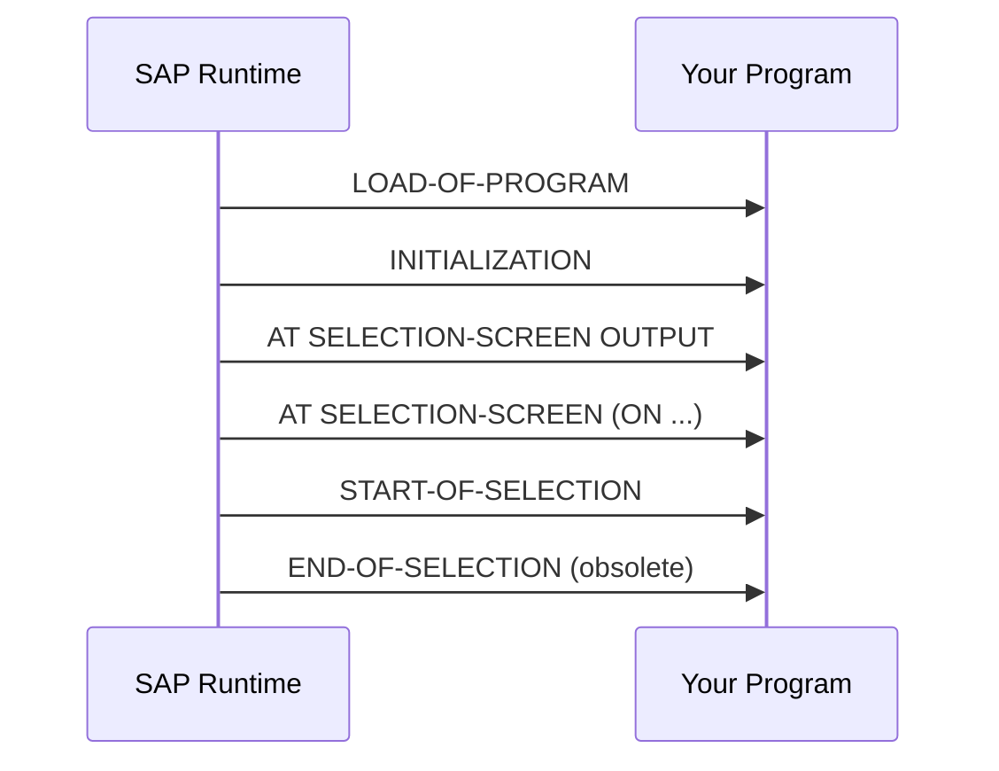

# 01 — ABAP Basics

> **Lifecycle:** `CLASSIC BUT STILL RELEVANT` for the executable-program skeleton and its reporting events; the class-based logic inside it is `CURRENT / RECOMMENDED`. See [21-Classic-vs-Modern-ABAP](../21-Classic-vs-Modern-ABAP/README.md#-classic-but-still-relevant).

## 📖 Introduction

Every ABAP program (report, class pool, or function pool) is built from a set of well-known **building blocks**: declarations, processing blocks (events), and statements. This chapter covers the skeleton of a classic ABAP report and the fundamental syntax you will see everywhere else in this guide.

> This chapter intentionally keeps a **local class + event blocks** structure, since that is the most common real-world pattern for OOP-based reports (see [13-ALV](../13-ALV/README.md) for the program this example is based on).

> 📝 **Target:** Standard ABAP. Executable programs and their reporting events exist only in Standard ABAP: ABAP for Cloud Development does not allow `REPORT`, `PROGRAM`, `INITIALIZATION`, `START-OF-SELECTION` or the selection-screen events. Class pools, function pools, `LOAD-OF-PROGRAM` and `CLASS … DEFINITION DEFERRED` are allowed there — see [Rule 1.4](../docs/ABAP-Development-Rules.md#14-state-the-target-language-version-when-it-matters).

## 🗃️ Program Types

| Introducing statement | Program type | Typical use | ABAP for Cloud Development |
|---|---|---|---|
| `REPORT` | Executable program | Reports started with `SUBMIT` or a transaction | Not allowed |
| `PROGRAM` | Module pool or subroutine pool | Dynpro applications | Not allowed |
| `FUNCTION-POOL` | Function pool (function group) | Function modules, RFC entry points | Allowed |
| `CLASS-POOL` | Class pool | One global class, maintained in the Class Builder or ADT | Allowed |

Each of these statements must be the first statement of its program after include programs are resolved.

## 🧱 Anatomy of an ABAP Program

| Block | Keyword | Purpose |
|---|---|---|
| Header | `REPORT` / `PROGRAM` | Declares the program name |
| Global declarations | `DATA`, `CLASS ... DEFINITION` | Data and class definitions valid for the whole program |
| Event blocks | `LOAD-OF-PROGRAM`, `INITIALIZATION`, `AT SELECTION-SCREEN`, `START-OF-SELECTION`, `END-OF-SELECTION` (obsolete) | Control the flow of a classical report |
| Implementation | `CLASS ... IMPLEMENTATION` | Method bodies |

## 🧪 Example — Program Header & Global Declarations

> 📝 **Contextual snippet** — assumes the `CLASS lcl_main IMPLEMENTATION` part, the structure `zsm_s_delivery`, and the dynpro with its modules; they are left out here.

```abap
"----------------------------------------------------------------------
" Report  : ZSM_R_DELIVERY_MONITOR
" Purpose : Displays open deliveries per plant for the daily review.
"           Read-only; no document is changed here.
" Ref     : <business requirement / ticket>
"----------------------------------------------------------------------
CLASS lcl_main DEFINITION DEFERRED.

" Dynpro modules are not part of the class; they reach the instance
" only through this one global reference.
DATA main TYPE REF TO lcl_main.

CLASS lcl_main DEFINITION FINAL.
  PUBLIC SECTION.
    METHODS start_of_selection.
  PRIVATE SECTION.
    DATA custom_container TYPE REF TO cl_gui_custom_container.
    DATA header_document  TYPE REF TO cl_dd_document.
    DATA grid             TYPE REF TO cl_gui_alv_grid.
    DATA splitter         TYPE REF TO cl_gui_splitter_container.
    DATA header_container TYPE REF TO cl_gui_container.
    DATA grid_container   TYPE REF TO cl_gui_container.
    DATA deliveries       TYPE TABLE OF zsm_s_delivery.
ENDCLASS.

INITIALIZATION.
  main = NEW #( ).

START-OF-SELECTION.
  main->start_of_selection( ).
```

> 📝 **Note:** `CLASS lcl_main DEFINITION DEFERRED.` is used so that the class name can be referenced (e.g., in `TYPE REF TO`) **before** its full definition appears later in the program — a common forward-declaration pattern in local classes.

> 💡 Each event block only calls a method of `lcl_main`. That keeps the logic in the class, where it can be tested, and is the recommended use of `START-OF-SELECTION` in the ABAP Keyword Documentation — see [Rule 5.1](../docs/ABAP-Development-Rules.md#51-write-new-logic-in-classes-wrap-function-modules-and-bapis).

## 🔄 Classical Report Event Flow


```mermaid
sequenceDiagram
    participant SAP as SAP Runtime
    participant Prg as Your Program
    SAP->>Prg: LOAD-OF-PROGRAM
    SAP->>Prg: INITIALIZATION
    SAP->>Prg: AT SELECTION-SCREEN OUTPUT
    SAP->>Prg: AT SELECTION-SCREEN (ON ...)
    SAP->>Prg: START-OF-SELECTION
    SAP->>Prg: END-OF-SELECTION (obsolete)
```

| Event | When It Fires |
|---|---|
| `LOAD-OF-PROGRAM` | When the program is loaded into the internal session — the program constructor. Initialize global data here; do not start user interaction or other processes whose flow the caller cannot control. |
| `INITIALIZATION` | Directly after `LOAD-OF-PROGRAM`, before the selection screen is processed. Defaults set here take effect only once; when the selection screen is shown again, it keeps the user's previous entries. |
| `AT SELECTION-SCREEN OUTPUT` | Raised by the PBO of the selection screen, right before it is displayed — used to modify screen attributes, and to set values that must apply each time the screen is shown |
| `AT SELECTION-SCREEN ON <field>` | Raised by the PAI of the selection screen, for validating a specific field |
| `START-OF-SELECTION` | Main processing block. Statements that are not declarations and stand before the first explicit processing block belong to an implicit `START-OF-SELECTION`. |
| `END-OF-SELECTION` | **Obsolete.** Intended only for programs linked to a logical database. Without one, it is raised directly after `START-OF-SELECTION` and needs no implementation. |

> **Lifecycle:** `LEGACY / HISTORICAL REFERENCE`. `END-OF-SELECTION` belongs to the obsolete logical databases. No replacement is needed: process and display the data in `START-OF-SELECTION`. See [21-Classic-vs-Modern-ABAP](../21-Classic-vs-Modern-ABAP/README.md#-legacy--historical-reference).

## ✅ Best Practices

- Put the logic into local classes and let each event block call one method — [Rule 5.1](../docs/ABAP-Development-Rules.md#51-write-new-logic-in-classes-wrap-function-modules-and-bapis).
- Keep global declarations to what the dynpro needs; hold everything else as class attributes — [Rules 5.4](../docs/ABAP-Development-Rules.md#54-depend-on-interfaces-and-receive-dependencies-through-the-constructor) and [5.6](../docs/ABAP-Development-Rules.md#56-keep-the-public-section-minimal).
- Use the header comment for the purpose and any non-obvious constraint, not for author and date — [Rules 11.1](../docs/ABAP-Development-Rules.md#111-say-it-in-code-first) and [11.6](../docs/ABAP-Development-Rules.md#116-mark-open-work-with-a-ticket-reference-not-a-personal-id), and [20-Best-Practices](../20-Best-Practices/README.md#-comments-abap-doc-and-program-headers). If your team mandates a banner, follow it, but put the effort into the purpose line.
- Name local types with the prefixes from the object naming table (`lcl_`, `lif_`, `ltc_`, `lth_`) — [Rule 2.6](../docs/ABAP-Development-Rules.md#26-name-development-objects-by-the-object-naming-table).

## ⚠️ Common Mistakes

- Forgetting `DEFERRED` when a class is referenced before its definition — causes a syntax error.
- Mixing classical procedural logic and OOP logic without a clear separation, making the report hard to navigate.
- Doing heavy logic directly in `INITIALIZATION` — this event should stay lightweight (default values only).
- Setting selection-screen defaults in `INITIALIZATION` and expecting them to be reapplied every time the screen is shown — use `AT SELECTION-SCREEN OUTPUT` for that.
- Implementing `END-OF-SELECTION` in a program without a logical database — the statement is obsolete and adds nothing.

## 🎤 Interview & Review Checkpoints

- Be ready to explain the **order of ABAP report events** (`LOAD-OF-PROGRAM` → `INITIALIZATION` → `AT SELECTION-SCREEN OUTPUT` → `AT SELECTION-SCREEN` → `START-OF-SELECTION`), and why `END-OF-SELECTION` is obsolete outside logical databases.
- Know the difference between a **report program** (`REPORT`), a **function group** (`FUNCTION-POOL`), and a **class pool** (`CLASS-POOL`, `CLASS ... DEFINITION PUBLIC`).

## 🔗 Related Chapters

- [10-Objects](../10-Objects/README.md) — classes used inside reports
- [12-Selection-Screens](../12-Selection-Screens/README.md) — selection-screen events in detail
- [13-ALV](../13-ALV/README.md) — the full OOP ALV report this example is based on
- [20-Best-Practices](../20-Best-Practices/README.md) — naming, program headers and the review checklist
- [21-Classic-vs-Modern-ABAP](../21-Classic-vs-Modern-ABAP/README.md) — the lifecycle labels used in this chapter
