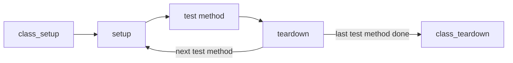

# 22 — ABAP Unit

> **Lifecycle:** `CURRENT / RECOMMENDED`. ABAP Unit is the test framework built into the ABAP language and tools, in Standard ABAP and in ABAP for Cloud Development. Test seams are `CLASSIC BUT STILL RELEVANT` and labelled where they appear. See [21-Classic-vs-Modern-ABAP](../21-Classic-vs-Modern-ABAP/README.md).

## 📖 Introduction

A unit test is ABAP code that calls a small piece of production code with known input and checks the result. ABAP Unit provides the statements for this (`FOR TESTING` and its additions), the class `cl_abap_unit_assert` for the checks, and the tools that run the tests.

According to the ABAP Keyword Documentation, test classes are not part of the production code: the system generates them only where the profile parameter `abap/test_generation` allows it, which is not the case in production systems. They are still transported with the code they test.

The rules for writing tests are in [section 10 of the rule set](../docs/ABAP-Development-Rules.md#10-testing). This chapter shows how to apply them, step by step, and ends with a complete example you can paste into a system. The rules build on two design rules from section 5: classes receive their dependencies as interface references through the constructor ([Rule 5.4](../docs/ABAP-Development-Rules.md#54-depend-on-interfaces-and-receive-dependencies-through-the-constructor)), and constructors only store them ([Rule 5.12](../docs/ABAP-Development-Rules.md#512-limit-constructors-to-setup)). Code written that way can be tested without tricks.

## 🧱 Test Classes, Risk Level and Duration

A test class is a local class with the addition `FOR TESTING`. For a global class, it lives in the class's **test include** (in ADT the *Test Classes* tab; the include name ends in `CCAU`). The test runner finds it there and runs it together with the class ([Rule 10.2](../docs/ABAP-Development-Rules.md#102-put-unit-tests-in-local-test-classes-with-risk-level-harmless-and-duration-short)).

> 📝 **Contextual snippet** — the declaration part of a test class; `zif_zsm_order_service` is a placeholder interface.

```abap
CLASS ltc_order_service DEFINITION FINAL FOR TESTING
  RISK LEVEL HARMLESS
  DURATION SHORT.

  PRIVATE SECTION.
    DATA cut TYPE REF TO zif_zsm_order_service.   " cut = code under test

    METHODS setup.
    METHODS releases_open_order     FOR TESTING RAISING cx_static_check.
    METHODS rejects_completed_order FOR TESTING RAISING cx_static_check.
ENDCLASS.
```

The two additions describe the test, and the system compares them with the limits maintained in transaction `SAUNIT_CLIENT_SETUP`:

| Addition | Value | Meaning |
|---|---|---|
| `RISK LEVEL` | `HARMLESS` | Changes neither persistent data nor system settings |
| | `DANGEROUS` | May change persistent data |
| | `CRITICAL` | May change system settings or Customizing |
| `DURATION` | `SHORT` | Runs for a few seconds at most |
| | `MEDIUM` | Runs for about a minute |
| | `LONG` | Runs for longer than a minute |

> ⚠️ **Without `RISK LEVEL`, a test class counts as `CRITICAL`.** The ABAP Keyword Documentation names `CRITICAL` as the default, and tests above the allowed risk level of the system are not executed. Always state both additions; for a unit test they are `HARMLESS` and `SHORT`.

> **Lifecycle:** `LEGACY / HISTORICAL REFERENCE` for the pseudo comments `"#AU Risk_Level …` and `"#AU Duration …`, which older test classes use for the same two properties. The ABAP Keyword Documentation classifies them as obsolete: they still take effect, but the additions `RISK LEVEL` and `DURATION` replace them. See [21-Classic-vs-Modern-ABAP](../21-Classic-vs-Modern-ABAP/README.md#-legacy--historical-reference).

> 💡 Set `DURATION` to the time the test really needs, not to the limit. A unit test that needs `MEDIUM` usually reaches a database or a remote system and should get a test double instead.

The prefixes come from the naming table: `ltc_` for test classes and `lth_` for test helpers, including hand-written test doubles ([Rule 2.6](../docs/ABAP-Development-Rules.md#26-name-development-objects-by-the-object-naming-table)).

## 🧪 Test Methods and Fixtures

A test method is an instance method declared with `FOR TESTING`. It has no parameters, and it is private, because only the test runner calls it. `RAISING cx_static_check` lets a test pass checked exceptions on, so the test does not have to catch exceptions it never expects. **[verify: how ABAP Unit reports an exception that leaves a test method; the ABAP Keyword Documentation only says that `RAISING` works as for other instance methods]**

Four optional private methods with fixed names prepare and clean up the test environment, the **fixture**:

| Method | Kind | Runs |
|---|---|---|
| `class_setup` | static (`CLASS-METHODS`) | once, before the first test method of the class |
| `setup` | instance | before each test method |
| `teardown` | instance | after each test method |
| `class_teardown` | static (`CLASS-METHODS`) | once, after the last test method of the class |



> 💡 Create the object under test and its doubles in `setup`, so every test method starts from a fresh object. Use `class_setup` only for what is expensive to build and can be shared, such as the ABAP SQL test environment below.

> ⚠️ **Never rely on the order of the test methods.** Each test must pass on its own; state that one test leaves behind for the next is a defect, even when the run happens to succeed.

## 📝 Given, When, Then — and Assertions

A test method has three parts ([Rule 10.5](../docs/ABAP-Development-Rules.md#105-structure-each-test-as-given-when-then)):

- **given** — the situation: the input, and what the test doubles return;
- **when** — exactly one call of the code under test;
- **then** — the checks on the result.

One test method checks one behaviour ([Rule 10.3](../docs/ABAP-Development-Rules.md#103-test-one-behaviour-per-test-method)) and is named after it ([Rule 10.4](../docs/ABAP-Development-Rules.md#104-name-test-methods-after-the-behaviour-they-check)), so the list of test methods reads like a specification.

The checks are static methods of `cl_abap_unit_assert` ([Rule 10.9](../docs/ABAP-Development-Rules.md#109-assert-with-cl_abap_unit_assert-using-the-most-specific-method)). The ABAP Keyword Documentation shows these:

| Method | Checks that |
|---|---|
| `assert_equals` | `act` equals `exp`; the failure message shows both values |
| `assert_initial` / `assert_not_initial` | a value is initial / not initial |
| `assert_bound` / `assert_not_bound` | a reference is bound / not bound |
| `assert_subrc` | `sy-subrc` has the expected value |
| `fail` | — it always fails; used where the code must not arrive |

> ⚠️ **Do not pass system fields such as `sy-subrc` to the assertion methods.** The documentation advises against it, because the call itself can change them. Use `assert_subrc`, or copy the value into a variable first.

An expected exception is tested with `fail` after the call: if the call returns normally, the test fails; if the exception arrives, the `CATCH` block checks it.

> 📝 **Contextual snippet** — the test class from above; `completed_order_id` and the exception class `zcx_zsm_order_not_releasable` with an attribute `order_id` are assumed.

```abap
METHOD rejects_completed_order.
  " given: see setup - the double knows completed_order_id as completed

  TRY.
      " when
      cut->release( completed_order_id ).
      cl_abap_unit_assert=>fail( msg = 'A completed order must not be released' ).

    CATCH zcx_zsm_order_not_releasable INTO DATA(error).
      " then
      cl_abap_unit_assert=>assert_equals( act = error->order_id
                                          exp = completed_order_id ).
  ENDTRY.
ENDMETHOD.
```

## 🔌 Test Doubles Through Interfaces

A test double replaces a dependency of the code under test: a repository that would read the database, a client that would call another system. The class under test receives the dependency as an interface reference through its constructor ([Rule 5.4](../docs/ABAP-Development-Rules.md#54-depend-on-interfaces-and-receive-dependencies-through-the-constructor)). Production passes the real implementation; the test passes a double. The class itself does not change ([Rule 10.6](../docs/ABAP-Development-Rules.md#106-replace-dependencies-with-test-doubles-through-interfaces-and-cl_abap_testdouble)).

There are two ways to build the double.

**Hand-written double.** A local class in the test include implements the interface and returns what the test needs. It is plain ABAP, easy to read in a failing test, and can record how it was called. The [complete example](#-complete-example) uses one.

If the interface has many methods and the test needs only a few, the addition `PARTIALLY IMPLEMENTED` spares you the empty implementations. The ABAP Keyword Documentation allows it only in test classes; a call of a method that is not implemented raises `CX_SY_DYN_CALL_ILLEGAL_METHOD`.

> 📝 **Contextual snippet** — `zif_zsm_order_repository` is a placeholder interface with more methods than the test needs.

```abap
CLASS lth_order_repository DEFINITION FINAL FOR TESTING.
  PUBLIC SECTION.
    INTERFACES zif_zsm_order_repository PARTIALLY IMPLEMENTED.
ENDCLASS.
```

**The ABAP test double framework.** `cl_abap_testdouble` creates a double for an interface at runtime. The test configures an answer and then calls the method once with the arguments the answer applies to; the framework records that call as the configuration. **[verify: the methods of `cl_abap_testdouble` (`create`, `configure_call`, `returning` and the others) and its release state for ABAP for Cloud Development]**

> 📝 **Contextual snippet** — the interface and class of the [complete example](#-complete-example); `tax_rates` is declared as `REF TO zif_zsm_tax_rates`.

```abap
METHOD setup.
  tax_rates = CAST zif_zsm_tax_rates( cl_abap_testdouble=>create( 'ZIF_ZSM_TAX_RATES' ) ).
  cut       = NEW zcl_zsm_gross_price( tax_rates ).
ENDMETHOD.

METHOD adds_tax_of_country.
  " given: rate_for( 'DE' ) answers 19.00
  cl_abap_testdouble=>configure_call( tax_rates )->returning(
      CONV zif_zsm_tax_rates=>percentage( '19.00' ) ).
  tax_rates->rate_for( 'DE' ).

  " when
  DATA(gross_amount) = cut->calculate( net_amount = CONV #( '100.00' )
                                       country    = 'DE' ).

  " then
  cl_abap_unit_assert=>assert_equals(
      act = gross_amount
      exp = CONV zif_zsm_gross_price=>amount( '119.00' ) ).
ENDMETHOD.
```

> 💡 Start with hand-written doubles. They need no framework knowledge, and when a test fails the double is right there to read. Switch to the framework when many tests need differently configured answers from the same interface.

## 🗄️ Isolating Database Access

A test that reads real table contents passes or fails with whatever the system contains, and a test that writes can damage it ([Rule 10.8](../docs/ABAP-Development-Rules.md#108-isolate-database-access-with-the-abap-sql-and-cds-test-double-frameworks-never-use-real-data)). The preferred design keeps ABAP SQL in a repository class behind an interface (see [08-Open-SQL](../08-Open-SQL/README.md) for the statements), so that the business logic is tested with a double as above.

The repository class itself is tested with the **ABAP SQL test environment**. `cl_osql_test_environment=>create` takes the database tables to replace in `i_dependency_list`. While the environment is active, the ABAP SQL statements of the code under test read and write test doubles of these tables instead of the real ones, and the test fills them with its own rows. The class is `CREATE PRIVATE FOR TESTING`, so only test code can use it.

> 📝 **Contextual snippet** — `zcl_zsm_order_db_repository` implements the placeholder interface `zif_zsm_order_repository`, whose method `read_open` returns the table type `zif_zsm_order_repository=>orders` with the line type of the placeholder table `zsm_t_order`; status `'O'` means open.

```abap
CLASS ltc_order_db_repository DEFINITION FINAL FOR TESTING
  RISK LEVEL HARMLESS
  DURATION SHORT.

  PRIVATE SECTION.
    CLASS-DATA sql_environment TYPE REF TO if_osql_test_environment.
    DATA cut TYPE REF TO zif_zsm_order_repository.

    CLASS-METHODS class_setup.
    CLASS-METHODS class_teardown.
    METHODS setup.
    METHODS reads_only_open_orders FOR TESTING RAISING cx_static_check.
ENDCLASS.


CLASS ltc_order_db_repository IMPLEMENTATION.
  METHOD class_setup.
    " Creating the environment is the slow part, so the class shares one
    sql_environment = cl_osql_test_environment=>create(
                          i_dependency_list = VALUE #( ( 'ZSM_T_ORDER' ) ) ).
  ENDMETHOD.

  METHOD class_teardown.
    sql_environment->destroy( ).
  ENDMETHOD.

  METHOD setup.
    " Every test method starts with empty doubles
    sql_environment->clear_doubles( ).
    cut = NEW zcl_zsm_order_db_repository( ).
  ENDMETHOD.

  METHOD reads_only_open_orders.
    " given
    DATA(open_order) = VALUE zsm_t_order( order_id = '1' status = 'O' ).
    DATA test_orders TYPE STANDARD TABLE OF zsm_t_order WITH EMPTY KEY.
    test_orders = VALUE #( ( open_order )
                           ( order_id = '2' status = 'C' ) ).
    sql_environment->insert_test_data( test_orders ).

    " when
    DATA(orders) = cut->read_open( ).

    " then
    cl_abap_unit_assert=>assert_equals(
        act = orders
        exp = VALUE zif_zsm_order_repository=>orders( ( open_order ) ) ).
  ENDMETHOD.
ENDCLASS.
```

> ⚠️ **VERSION-DEPENDENT: ABAP SQL and CDS test environments.** Availability and API details depend on the release; [Rule 10.8](../docs/ABAP-Development-Rules.md#108-isolate-database-access-with-the-abap-sql-and-cds-test-double-frameworks-never-use-real-data) lists what is verified. Check the [ABAP Keyword Documentation](https://help.sap.com/doc/abapdocu_latest_index_htm/latest/en-US/index.htm).

> 📝 Code that reads CDS views is tested with the CDS test environment (`cl_cds_test_environment`), which works in the same way for the data sources of a view. CDS is outside this guide; see [CDSGuide](https://github.com/serhatmercan/CDSGuide).

## 🪡 Test Seams for Legacy Code

> **Lifecycle:** `CLASSIC BUT STILL RELEVANT`. A bridge for testing existing code that cannot take a dependency yet; new code receives its dependencies through the constructor instead. See [21-Classic-vs-Modern-ABAP](../21-Classic-vs-Modern-ABAP/README.md).

A test seam marks a block of production code that a test may replace ([Rule 10.7](../docs/ABAP-Development-Rules.md#107-use-test-seams-only-for-legacy-code-that-cannot-be-restructured-yet)). In production the block runs unchanged. In a test, a `TEST-INJECTION` with the same name replaces it while the test method runs. According to the ABAP Keyword Documentation:

- injections are allowed only in test classes in the test include, so seams work in class pools and function pools;
- an injection takes effect for the current test method (or `setup`) and is undone when the test method ends;
- an empty injection removes the block's code for the test;
- seams are meant mainly for existing code without separation of concerns.

> 📝 **Contextual snippet** — a method of an existing class that reads the database directly; `customer_id`, the constant `open` and the returning parameter `result` belong to that method; in the test, `cut` and `test_customer_id` are assumed.

```abap
" Production code: the SELECT becomes replaceable in tests
METHOD count_open_orders.
  TEST-SEAM read_open_orders.
    SELECT COUNT(*) FROM zsm_t_order
      WHERE customer_id = @customer_id
        AND status      = @open
      INTO @result.
  END-TEST-SEAM.
ENDMETHOD.
```

```abap
" Test method in the test include of the same class
METHOD counts_open_orders.
  " given: the injected code runs in place of the SELECT
  TEST-INJECTION read_open_orders.
    result = 3.
  END-TEST-INJECTION.

  " when
  DATA(open_orders) = cut->count_open_orders( test_customer_id ).

  " then
  cl_abap_unit_assert=>assert_equals( act = open_orders
                                      exp = 3 ).
ENDMETHOD.
```

> ⚠️ **A seam ties the test to the inside of the method.** The test knows the seam's name and the variables of the replaced block, so it breaks when the method is restructured. Use the seam to pin the current behaviour, then refactor towards an injected dependency and replace the seam with a double.

## ▶️ Running the Tests

Tests protect only when they run regularly, ideally without anyone having to remember them ([Rule 10.10](../docs/ABAP-Development-Rules.md#1010-run-the-tests-in-atc-and-in-continuous-integration)).

| Where | How |
|---|---|
| **ADT for Eclipse** | Run the tests of the open object or of a whole package from the context menu (*Run As → ABAP Unit Test*); a coverage run shows which statements the tests reached. **[verify: menu names and keyboard shortcuts in your ADT version]** |
| **Visual Studio Code** | **[verify: the SAP tooling for ABAP in Visual Studio Code available to you, and how it runs ABAP Unit]** |
| **SAP GUI** | From the editor of the class or program; for larger sets, the ABAP Unit Browser in the Object Navigator (`SE80`). |
| **ABAP Test Cockpit (ATC)** | ATC can run the ABAP Unit tests together with the static checks. Include ABAP Unit in the team's check variant ([Rule 13.1](../docs/ABAP-Development-Rules.md#131-release-nothing-that-fails-the-syntax-check-abap-unit-or-atc-with-the-team-check-variant)). |
| **Continuous integration** | Where a pipeline exists, let it start the ATC run (with ABAP Unit) for every change, so a red test blocks the change before it is transported. |

> 📝 A global test class (a class pool defined `FOR TESTING`) names the repository objects it tests with a test relation, the ABAP Doc annotation `"! @testing`. This is how objects that cannot have a test include of their own get tests.

## 🧩 Complete Example

A gross price calculator adds a country's tax rate to a net amount. It depends on a source of tax rates, which it receives as an interface reference. The test replaces that source with a hand-written double, so the test needs no database and no Customizing.

The example uses no database table, no DDIC type and no API other than `cl_abap_unit_assert`, so the same source is meant for both Standard ABAP and ABAP for Cloud Development. It consists of four objects:

1. the interface `zif_zsm_tax_rates` — the dependency;
2. the interface `zif_zsm_gross_price` — the contract of the class ([Rule 5.4](../docs/ABAP-Development-Rules.md#54-depend-on-interfaces-and-receive-dependencies-through-the-constructor));
3. the class `zcl_zsm_gross_price`;
4. the test include of that class.

```abap
INTERFACE zif_zsm_tax_rates PUBLIC.
  TYPES country_code TYPE c LENGTH 2.
  TYPES percentage   TYPE p LENGTH 5 DECIMALS 2.

  "! Returns the tax rate of a country in percent
  METHODS rate_for
    IMPORTING country       TYPE country_code
    RETURNING VALUE(result) TYPE percentage.
ENDINTERFACE.
```

```abap
INTERFACE zif_zsm_gross_price PUBLIC.
  TYPES amount TYPE p LENGTH 15 DECIMALS 2.

  "! Adds the country's tax to a net amount, rounded to two decimals
  METHODS calculate
    IMPORTING net_amount    TYPE amount
              country       TYPE zif_zsm_tax_rates=>country_code
    RETURNING VALUE(result) TYPE amount.
ENDINTERFACE.
```

```abap
CLASS zcl_zsm_gross_price DEFINITION PUBLIC FINAL CREATE PUBLIC.
  PUBLIC SECTION.
    INTERFACES zif_zsm_gross_price.

    METHODS constructor
      IMPORTING tax_rates TYPE REF TO zif_zsm_tax_rates.

  PRIVATE SECTION.
    DATA tax_rates TYPE REF TO zif_zsm_tax_rates.
ENDCLASS.


CLASS zcl_zsm_gross_price IMPLEMENTATION.
  METHOD constructor.
    me->tax_rates = tax_rates.
  ENDMETHOD.

  METHOD zif_zsm_gross_price~calculate.
    DATA(rate) = tax_rates->rate_for( country ).

    " The packed calculation keeps all decimals; assigning the result to
    " the two-decimal type rounds it commercially
    result = net_amount + net_amount * rate / 100.
  ENDMETHOD.
ENDCLASS.
```

```abap
"! Test double for the tax rate source: answers with a rate that the
"! test sets, and records the country it was asked for
CLASS lth_fixed_tax_rates DEFINITION FINAL FOR TESTING.
  PUBLIC SECTION.
    INTERFACES zif_zsm_tax_rates.

    DATA requested_country TYPE zif_zsm_tax_rates=>country_code READ-ONLY.

    METHODS answer_with
      IMPORTING rate TYPE zif_zsm_tax_rates=>percentage.

  PRIVATE SECTION.
    DATA rate TYPE zif_zsm_tax_rates=>percentage.
ENDCLASS.


CLASS lth_fixed_tax_rates IMPLEMENTATION.
  METHOD answer_with.
    me->rate = rate.
  ENDMETHOD.

  METHOD zif_zsm_tax_rates~rate_for.
    requested_country = country.
    result = rate.
  ENDMETHOD.
ENDCLASS.


CLASS ltc_gross_price DEFINITION FINAL FOR TESTING
  RISK LEVEL HARMLESS
  DURATION SHORT.

  PRIVATE SECTION.
    DATA cut       TYPE REF TO zif_zsm_gross_price.
    DATA tax_rates TYPE REF TO lth_fixed_tax_rates.

    METHODS setup.
    METHODS adds_tax_of_country      FOR TESTING.
    METHODS rounds_to_two_decimals   FOR TESTING.
    METHODS keeps_net_at_zero_rate   FOR TESTING.
    METHODS asks_for_given_country   FOR TESTING.
ENDCLASS.


CLASS ltc_gross_price IMPLEMENTATION.
  METHOD setup.
    " A fresh double and a fresh object for every test method
    tax_rates = NEW #( ).
    cut       = NEW zcl_zsm_gross_price( tax_rates ).
  ENDMETHOD.

  METHOD adds_tax_of_country.
    " given
    tax_rates->answer_with( CONV #( '19.00' ) ).

    " when
    DATA(gross_amount) = cut->calculate( net_amount = CONV #( '100.00' )
                                         country    = 'DE' ).

    " then
    cl_abap_unit_assert=>assert_equals(
        act = gross_amount
        exp = CONV zif_zsm_gross_price=>amount( '119.00' ) ).
  ENDMETHOD.

  METHOD rounds_to_two_decimals.
    " given: 9.99 plus 7 % is 10.6893
    tax_rates->answer_with( CONV #( '7.00' ) ).

    " when
    DATA(gross_amount) = cut->calculate( net_amount = CONV #( '9.99' )
                                         country    = 'DE' ).

    " then: rounded, not truncated
    cl_abap_unit_assert=>assert_equals(
        act = gross_amount
        exp = CONV zif_zsm_gross_price=>amount( '10.69' ) ).
  ENDMETHOD.

  METHOD keeps_net_at_zero_rate.
    " given
    tax_rates->answer_with( CONV #( '0.00' ) ).

    " when
    DATA(gross_amount) = cut->calculate( net_amount = CONV #( '50.00' )
                                         country    = 'DE' ).

    " then
    cl_abap_unit_assert=>assert_equals(
        act = gross_amount
        exp = CONV zif_zsm_gross_price=>amount( '50.00' ) ).
  ENDMETHOD.

  METHOD asks_for_given_country.
    " given
    tax_rates->answer_with( CONV #( '20.00' ) ).

    " when
    cut->calculate( net_amount = CONV #( '10.00' )
                    country    = 'FR' ).

    " then
    cl_abap_unit_assert=>assert_equals( act = tax_rates->requested_country
                                        exp = 'FR' ).
  ENDMETHOD.
ENDCLASS.
```

> 💡 The test double is declared with its own class type (`REF TO lth_fixed_tax_rates`), so the test can call `answer_with` and read `requested_country`. The class under test only sees the interface.

**To try it:** create the two interfaces and the class as local objects, activate them in that order, paste the last block into the class's test include, activate it, and run the class's unit tests. All four tests should pass. Then break the calculation, for example by removing the `+ net_amount`, and watch the tests name what broke.

> 📝 **Where to create local objects.** In Standard ABAP, the local package `$TMP` can be used. In an SAP BTP ABAP environment, `ZLOCAL` is a structure package, so first create a development package below it (software component `LOCAL`) and create the objects there.

> 📝 **Activation record.** The two interfaces, the class and its test classes were activated, and the 4 test methods were run with all 4 passing, in both ABAP language versions: Standard ABAP and ABAP for Cloud Development.

## 🧭 Scope Note

- **CDS test doubles** are covered only as a pointer; CDS belongs to [CDSGuide](https://github.com/serhatmercan/CDSGuide).
- **Tests of RAP business objects, AMDP and ABAP Cloud specifics** are outside this guide; see [21-Classic-vs-Modern-ABAP](../21-Classic-vs-Modern-ABAP/README.md).
- **Integration tests and UI tests** (several units, real databases, browser-driven tests) are a different discipline and not covered here.

## ✅ Best Practices

- Write tests for every new class, and add one before you change existing logic — [Rule 10.1](../docs/ABAP-Development-Rules.md#101-write-abap-unit-tests-for-every-new-class).
- Declare unit tests `RISK LEVEL HARMLESS` and `DURATION SHORT`; explain any other value in a comment — [Rule 10.2](../docs/ABAP-Development-Rules.md#102-put-unit-tests-in-local-test-classes-with-risk-level-harmless-and-duration-short).
- Build the object under test and its doubles in `setup`, so the tests are independent of each other.
- One behaviour per test method, named after that behaviour, structured as given / when / then — [Rules 10.3–10.5](../docs/ABAP-Development-Rules.md#103-test-one-behaviour-per-test-method).
- Hand dependencies in through the constructor as interface references and replace them with doubles — [Rules 5.4](../docs/ABAP-Development-Rules.md#54-depend-on-interfaces-and-receive-dependencies-through-the-constructor) and [10.6](../docs/ABAP-Development-Rules.md#106-replace-dependencies-with-test-doubles-through-interfaces-and-cl_abap_testdouble).
- Keep constructors free of work, so creating the object in a test has no side effects — [Rule 5.12](../docs/ABAP-Development-Rules.md#512-limit-constructors-to-setup).
- Test repository classes against the ABAP SQL test environment, never against real data — [Rule 10.8](../docs/ABAP-Development-Rules.md#108-isolate-database-access-with-the-abap-sql-and-cds-test-double-frameworks-never-use-real-data).
- Use the most specific assertion, and compare content rather than counts — [Rule 10.9](../docs/ABAP-Development-Rules.md#109-assert-with-cl_abap_unit_assert-using-the-most-specific-method).
- Run the tests in ATC and in the pipeline — [Rule 10.10](../docs/ABAP-Development-Rules.md#1010-run-the-tests-in-atc-and-in-continuous-integration).

## ⚠️ Common Mistakes

- Omitting `RISK LEVEL`, so the class counts as `CRITICAL` and is not executed where that level is not allowed.
- Testing against whatever the development system contains — the test passes today and fails after the next data refresh.
- Creating the object under test once in `class_setup` and letting the tests share its state.
- Checking several behaviours in one test method, so the first failure hides the others.
- Asserting with a generic check (`assert_not_initial`) where `assert_equals` would show what was expected and what arrived.
- Passing `sy-subrc` directly to an assertion method instead of using `assert_subrc`.
- Testing an expected exception without `fail` after the call, so the test also passes when no exception is raised.
- Using test seams in new code instead of designing the dependency as an interface.
- Running the tests only by hand.

## 🎤 Interview & Review Checkpoints

- Explain what `RISK LEVEL` and `DURATION` express and what happens when `RISK LEVEL` is missing.
- Name the four fixture methods and the order in which they run.
- Explain given / when / then and why "when" is exactly one call.
- Explain how constructor injection makes a class testable, and compare a hand-written double with `cl_abap_testdouble`.
- Explain how the ABAP SQL test environment isolates a repository class from real data.
- Explain what a test seam is, when it is acceptable and why it is not a design for new code.
- Explain why test classes do not reach production systems.

## 🖥️ Related Transaction Codes

| T-Code | Purpose |
|---|---|
| SE80 | Object Navigator — ABAP Unit Browser for running larger sets of tests |
| ATC | ABAP Test Cockpit — static checks and ABAP Unit in one run |
| SAUNIT_CLIENT_SETUP | Allowed risk level and duration limits per client |

## 🔗 Related Chapters

- [08-Open-SQL](../08-Open-SQL/README.md) — the ABAP SQL statements that a repository class encapsulates
- [10-Objects](../10-Objects/README.md) — interfaces, constructors and visibility used by testable classes
- [18-Debugging](../18-Debugging/README.md) — class-based exceptions that tests expect and check
- [20-Best-Practices](../20-Best-Practices/README.md) — refactoring legacy code with tests in place
- [21-Classic-vs-Modern-ABAP](../21-Classic-vs-Modern-ABAP/README.md) — where ABAP Unit and test seams sit in the lifecycle map
