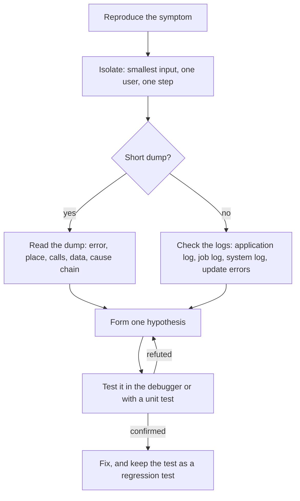

# 23 — Debugging & Troubleshooting

> **Lifecycle:** `CURRENT / RECOMMENDED`. The ABAP Debugger, checkpoints and short dumps are the everyday tools for finding a defect. `BREAK-POINT` and `LOG-POINT` exist only in Standard ABAP, and each section states what applies in ABAP for Cloud Development. See [21-Classic-vs-Modern-ABAP](../21-Classic-vs-Modern-ABAP/README.md).

## 📖 Introduction

Debugging answers one question: what does the program really do at this point, with this data? Troubleshooting is the wider job around it, getting from a symptom ("the job failed", "the screen dumps") to a cause and a fix that stays fixed.

This chapter covers:

- the ABAP Debugger, breakpoints and watchpoints;
- the checkpoint statements `BREAK-POINT`, `ASSERT` and `LOG-POINT` with checkpoint groups;
- runtime errors and short dumps;
- a method for troubleshooting, and a list of common runtime errors.

Messages, exceptions and the application log are the subject of [18-Debugging](../18-Debugging/README.md), whose folder keeps its historical name. Measuring performance (`SAT`, `ST05`) belongs to [19-Performance](../19-Performance/README.md). The rules behind this chapter are [Rule 6.12](../docs/ABAP-Development-Rules.md#612-state-the-internal-assumptions-of-a-program-with-assert-raise-exceptions-for-situations-a-caller-or-user-can-act-on) (assertions) and [Rule 13.6](../docs/ABAP-Development-Rules.md#136-release-no-always-active-breakpoint-no-break-point-without-id-and-no-break-user-macro) (no always-active breakpoints in released code).

## 🗺️ Standard ABAP and ABAP for Cloud Development at a Glance

Every ABAP object has a language version, and the syntax check enforces it ([Rule 1.1](../docs/ABAP-Development-Rules.md#11-know-the-language-version-of-every-object-you-change)). For the checkpoint and termination statements, the overview of language elements per ABAP language version in the ABAP Keyword Documentation (7.58) says:

| Statement | Standard ABAP | ABAP for Cloud Development |
|---|---|---|
| `ASSERT`, including `ID`, `SUBKEY`, `FIELDS` and `CONDITION` | allowed | allowed |
| `BREAK-POINT`, with or without `ID` | allowed | not allowed |
| `LOG-POINT` | allowed | not allowed |
| `RAISE SHORTDUMP`, `THROW SHORTDUMP` | allowed | allowed |

> ⚠️ **VERSION-DEPENDENT: language elements per ABAP language version.** The table follows the 7.58 overview. Check the overview in the [ABAP Keyword Documentation](https://help.sap.com/doc/abapdocu_latest_index_htm/latest/en-US/index.htm) for your release.

The tools differ as well. On-premise you can debug from ADT or from SAP GUI, and analyse short dumps in transaction `ST22`. In an SAP BTP ABAP environment, development and debugging take place in ADT. **[verify: the debugging and dump-analysis tools of your SAP BTP ABAP environment, and whether checkpoint groups for `ASSERT ID` can be created and activated there]**

## 🐞 The ABAP Debugger in ADT and SAP GUI

The debugger stops a program at a breakpoint and lets you step through it statement by statement, inspect and compare variables and internal tables, and follow the call stack. Two habits make it far more effective:

- **One statement per line.** The debugger and breakpoints work per line, so a chained or crowded line hides which part ran ([Rule 12.2](../docs/ABAP-Development-Rules.md#122-write-no-more-than-one-statement-per-line)).
- **No macros.** A macro cannot be executed step by step ([Rule 3.19](../docs/ABAP-Development-Rules.md#319-do-not-write-macros-use-methods-or-expressions)).

In ADT, you set a breakpoint in the source and run the object; the debugger opens in the debug perspective. In SAP GUI, you set it in the ABAP Editor, or switch debugging on for the next action by entering `/h` in the command field. **[verify: menu names, keyboard shortcuts and step commands in your ADT and SAP GUI versions]**

According to the ABAP Keyword Documentation, breakpoints in system programs (names starting with `%_`) are respected only when system debugging is switched on, for example with `/hs` in the command field.

> ⚠️ **Debugging in a production system is a controlled activity.** Changing a variable's value in the debugger bypasses every check of the application, so the authorization for it is a privileged permission, not a convenience. **[verify: the authorization that allows changing values in the debugger, and how such changes are recorded in your system]**

**Standard ABAP / ABAP for Cloud Development:** the debugger in ADT serves both; the SAP GUI debugger and `/h` need SAP GUI, which on-premise systems provide.

## 📍 Breakpoints and Watchpoints

According to the ABAP Keyword Documentation, a breakpoint that you set in the ABAP Editor or in the debugger has a limited lifespan and applies to your own ABAP user. The statement `BREAK-POINT` is the other kind: it lives in the code (see the next section).

An interactive breakpoint has a **scope**, which decides in which sessions it applies:

| Scope | Applies to |
|---|---|
| Session breakpoint | the current session of your user |
| External (user) breakpoint | sessions of your user that are started from outside, such as an RFC or HTTP call |

It also has a **kind**, which decides when it stops:

| Kind | Stops when |
|---|---|
| Line breakpoint | the program reaches a line |
| Statement breakpoint | a given statement is executed, for example every `CALL FUNCTION` |
| Exception breakpoint | a given exception class is raised, wherever that happens |
| Conditional breakpoint | the line is reached and a condition holds |
| Watchpoint | the value of a variable changes, optionally only when a condition holds, for example a counter reaching a given value |

**[verify: which of these kinds your ADT and SAP GUI versions offer, under which names, and where they are set]**

> 💡 An exception breakpoint finds the place where an exception is **raised**, not where it is caught or where the program dumps. Use it when a short dump only shows the handler or the end of a long chain.

### Where a Breakpoint Stops

A breakpoint does not stop everywhere. The ABAP Keyword Documentation describes this for the statement `BREAK-POINT`:

| Processing | Behaviour of an active breakpoint |
|---|---|
| Dialog | The debugger opens. |
| Background | No stop. An always-active `BREAK-POINT` writes an entry ("breakpoint reached") to the system log; an activatable one is ignored. |
| Update task | Stops only when update debugging is switched on in the debugger; otherwise as in background processing. A local update behaves like dialog. |
| RFC | Stops in the SAP GUI debugger when an RFC dialog is possible; the ADT debugger can be shown even when it is not. |
| HTTP (ICF) and APC | Stops only when external debugging is switched on, for a limited time (by default two hours) in transaction `SICF` or by setting an external breakpoint. ADT can show its debugger even without it. |

**Background jobs and running processes** need their own approach: debug the job step on purpose, or attach the debugger to the running process from the work process overview. **[verify: how to debug a background job and how to attach to a running work process in your system]**

> ⚠️ **Do not step through a `SELECT … ENDSELECT` loop.** The documentation warns that a breakpoint in a `SELECT` loop can raise an exception because the database cursor is lost: debugging can trigger a database commit. Read the data into an internal table first and debug the loop over the table ([Rule 9.7](../docs/ABAP-Development-Rules.md#97-do-not-use-select--endselect-to-read-row-by-row)).

**Standard ABAP / ABAP for Cloud Development:** interactive breakpoints are a tool feature, not a statement, so the language version does not restrict them; which kinds exist depends on the tool (see the marker above).

## 🧷 Checkpoints in Code: BREAK-POINT, ASSERT, LOG-POINT

Checkpoints are statements that support testing and maintenance; they are not part of the application logic. According to the ABAP Keyword Documentation, `ASSERT` defines a conditional checkpoint, while `BREAK-POINT` and `LOG-POINT` define unconditional ones.

| Statement | When it is active | Without `ID` | ABAP for Cloud Development |
|---|---|---|---|
| `BREAK-POINT` | Opens the debugger in dialog processing (see the table above for other processing) | Always active — not allowed in released code ([Rule 13.6](../docs/ABAP-Development-Rules.md#136-release-no-always-active-breakpoint-no-break-point-without-id-and-no-break-user-macro)) | not allowed |
| `ASSERT` | Evaluates its condition; if the condition is false, the program ends with the runtime error `ASSERTION_FAILED`, or the checkpoint group's setting decides | Always active — the normal form for internal assumptions ([Rule 6.12](../docs/ABAP-Development-Rules.md#612-state-the-internal-assumptions-of-a-program-with-assert-raise-exceptions-for-situations-a-caller-or-user-can-act-on)) | allowed |
| `LOG-POINT` | Writes an entry to the checkpoint log, which is evaluated in transaction `SAAB` | Not possible — `ID` is mandatory. A test tool, removed before release ([Rule 13.6](../docs/ABAP-Development-Rules.md#136-release-no-always-active-breakpoint-no-break-point-without-id-and-no-break-user-macro)) | not allowed |

The ABAP Keyword Documentation states that always-active breakpoints are meant only for tests, are not allowed in production programs, and that the extended program check reports `BREAK-POINT` without `ID` as an error. Of these test statements, the documentation names `ASSERT` and `BREAK-POINT` with `ID` as the ones production programs may contain, because they do not hinder the program flow; `LOG-POINT` is described on its own page as a tool for tests, so [Rule 13.6](../docs/ABAP-Development-Rules.md#136-release-no-always-active-breakpoint-no-break-point-without-id-and-no-break-user-macro) removes it before release. `BREAK` followed by a user name is not a statement but a predefined macro; [Rule 13.6](../docs/ABAP-Development-Rules.md#136-release-no-always-active-breakpoint-no-break-point-without-id-and-no-break-user-macro) excludes it as well.

### Assertions

An assertion states something the program itself guarantees. If it is false, the program has a defect, and continuing would only spread wrong data. That is different from bad input or a missing record, which a caller can act on and which therefore raise an exception ([Rule 6.12](../docs/ABAP-Development-Rules.md#612-state-the-internal-assumptions-of-a-program-with-assert-raise-exceptions-for-situations-a-caller-or-user-can-act-on), [Rule 6.3](../docs/ABAP-Development-Rules.md#63-choose-the-exception-category-by-what-the-caller-can-do)).

**Example E1 — an always-active assertion.** Target: Standard ABAP and ABAP for Cloud Development.

```abap
CLASS zcl_zsm_order_packages DEFINITION PUBLIC FINAL CREATE PUBLIC.
  PUBLIC SECTION.
    TYPES package_quantities TYPE STANDARD TABLE OF i WITH EMPTY KEY.

    "! Splits a quantity into full packages and a last, smaller one.
    "! Returns no packages when the quantity or the package size is below 1.
    METHODS split
      IMPORTING quantity      TYPE i
                package_size  TYPE i
      RETURNING VALUE(result) TYPE package_quantities.
ENDCLASS.


CLASS zcl_zsm_order_packages IMPLEMENTATION.
  METHOD split.
    IF quantity < 1 OR package_size < 1.
      RETURN.
    ENDIF.

    DATA(full_packages) = quantity DIV package_size.
    DATA(remainder)     = quantity MOD package_size.

    result = VALUE #( FOR n = 1 UNTIL n > full_packages ( package_size ) ).
    IF remainder > 0.
      APPEND remainder TO result.
    ENDIF.

    " The split must neither lose nor invent units. If it does, this
    " method is wrong - no caller could do anything about it.
    ASSERT REDUCE i( INIT sum = 0
                     FOR package IN result
                     NEXT sum = sum + package ) = quantity.
  ENDMETHOD.
ENDCLASS.
```

> ⚠️ **The condition of an assertion must have no side effects.** The ABAP Keyword Documentation requires this for functional methods in the condition, especially for activatable assertions: otherwise the program behaves differently depending on whether the assertion is active.

### Checkpoint Groups

With the addition `ID`, a **checkpoint group** controls a checkpoint from outside the program. A checkpoint group is a repository object, maintained in transaction `SAAB`, and named with `zsm_cp_` ([Rule 2.6](../docs/ABAP-Development-Rules.md#26-name-development-objects-by-the-object-naming-table)). According to the ABAP Keyword Documentation:

- an activation setting has a validity area (the checkpoints of the group, or of a compilation unit), a context (users, server instances) and an operation mode;
- for assertions, the modes are *inactive*, *log* (write an entry and continue), *stop* (open the debugger in dialog; in background, update and HTTP processing the alternative "log" or "cancel" applies) and *cancel* (end with `ASSERTION_FAILED`);
- logpoints are either inactive or log;
- activation variants combine settings for several groups;
- active settings are valid only for a limited time, so a forgotten activation expires.

**Example E2 — activatable checkpoints.** Target: Standard ABAP only (`BREAK-POINT` is not allowed in ABAP for Cloud Development).

> 📝 **Contextual snippet** — the method `split` from E1; the checkpoint group `zsm_cp_order` exists in `SAAB`.

```abap
METHOD split.
  IF quantity < 1 OR package_size < 1.
    RETURN.
  ENDIF.

  DATA(full_packages) = quantity DIV package_size.
  DATA(remainder)     = quantity MOD package_size.

  result = VALUE #( FOR n = 1 UNTIL n > full_packages ( package_size ) ).
  IF remainder > 0.
    " Inactive until the group's settings activate breakpoints for a user
    BREAK-POINT ID zsm_cp_order.
    APPEND remainder TO result.
  ENDIF.

  " Activatable: costs nothing while the group is inactive
  ASSERT ID zsm_cp_order
         FIELDS quantity package_size
         CONDITION REDUCE i( INIT sum = 0
                             FOR package IN result
                             NEXT sum = sum + package ) = quantity.
ENDMETHOD.
```

> 💡 Keep an always-active `ASSERT` for cheap checks of important assumptions. Use `ASSERT ID` when the check is expensive, or when you want to collect violations in the log before you decide to stop on them.

**`LOG-POINT` — a test-only statement.** Target: Standard ABAP only.

> 📝 **Contextual snippet** — a test-only statement in the method `split`: add it while you investigate, and remove it before release ([Rule 13.6](../docs/ABAP-Development-Rules.md#136-release-no-always-active-breakpoint-no-break-point-without-id-and-no-break-user-macro)). The checkpoint group `zsm_cp_order` exists in `SAAB`.

```abap
" Test only: inactive until the group is set to "log"; SAAB then shows the calls
LOG-POINT ID zsm_cp_order
          SUBKEY |{ package_size }|
          FIELDS quantity package_size.
```

> 💡 A dynamic logpoint, set in transaction `SDLP` or in ADT, needs no change to the code and therefore no transport. Prefer it whenever you only want to see which values reach a point.

> 📝 `LOG-POINT` is not an application log. The documentation states that there is no API to read the checkpoint log, so it is meant for tests only. Logging that operations or users read belongs in the application log — see [18-Debugging](../18-Debugging/README.md#application-log-bal).

**Standard ABAP / ABAP for Cloud Development:** `ASSERT`, with or without `ID`, is available in both; `BREAK-POINT` and `LOG-POINT` only in Standard ABAP.

## 💥 Runtime Errors and Short Dumps

According to the ABAP Keyword Documentation, a **runtime error** ends a program when:

- a catchable exception is not handled, or an uncatchable exception is raised;
- the program forces it with `RAISE SHORTDUMP` or `THROW SHORTDUMP`;
- an assertion fails;
- an exit message (type `X`) is sent — see [18-Debugging](../18-Debugging/README.md#-message-types).

Every runtime error has a name, triggers a **database rollback**, and by default produces a **short dump**. The short dump contains the name of the runtime error, the exception class, the contents of data objects, the active calls and control structures, and lets you branch to the debugger. Short dumps are kept for 14 days by default and analysed in transaction `ST22`.

### Ending a Program on Purpose

Three tools end or guard a program, each for its own situation ([Rule 6.12](../docs/ABAP-Development-Rules.md#612-state-the-internal-assumptions-of-a-program-with-assert-raise-exceptions-for-situations-a-caller-or-user-can-act-on)):

| Situation | Use |
|---|---|
| An internal assumption is violated — a programming error | `ASSERT` |
| A runtime situation that nobody in the call chain can fix, such as missing must-have configuration | an exception of category `CX_NO_CHECK`, which the boundary handler logs ([Rule 6.3](../docs/ABAP-Development-Rules.md#63-choose-the-exception-category-by-what-the-caller-can-do)) |
| A deliberate termination whose short dump must carry the cause chain | `RAISE SHORTDUMP` with a `PREVIOUS` exception |

`RAISE SHORTDUMP` raises the runtime error `RAISE_SHORTDUMP`. The exception object is used only to transport information: the short dump shows its class and text, and lists the exceptions referenced through `PREVIOUS` as a chain. A type `X` message carries no such chain, and the rules keep `MESSAGE` statements out of the layers below the UI ([Rule 6.11](../docs/ABAP-Development-Rules.md#611-use-message-statements-only-in-the-ui-layer)).

**Example E3 — a deliberate short dump with its cause.** Target: Standard ABAP and ABAP for Cloud Development (VERSION-DEPENDENT: on-premise, `if_oo_adt_classrun` must exist in your release). `zcx_zsm_inconsistent_state` is a placeholder exception class (for example a subclass of `CX_NO_CHECK` created with the standard constructor); its category does not matter to `RAISE SHORTDUMP`.

```abap
CLASS zcl_zsm_shortdump_demo DEFINITION PUBLIC FINAL CREATE PUBLIC.
  PUBLIC SECTION.
    INTERFACES if_oo_adt_classrun.

  PRIVATE SECTION.
    TYPES: BEGIN OF exchange_rate,
             currency TYPE c LENGTH 3,
             rate     TYPE decfloat34,
           END OF exchange_rate.
    TYPES exchange_rates TYPE SORTED TABLE OF exchange_rate WITH UNIQUE KEY currency.
ENDCLASS.


CLASS zcl_zsm_shortdump_demo IMPLEMENTATION.
  METHOD if_oo_adt_classrun~main.
    " Assume the run checked earlier that every currency it needs has a
    " rate; USD is left out here on purpose to produce the dump
    DATA(rates) = VALUE exchange_rates( ( currency = 'EUR' rate = '1' ) ).

    TRY.
        DATA(usd_rate) = rates[ currency = 'USD' ]-rate.
        out->write( usd_rate ).
      CATCH cx_sy_itab_line_not_found INTO DATA(missing_rate).
        " Stop deliberately; the short dump lists missing_rate as the cause
        RAISE SHORTDUMP NEW zcx_zsm_inconsistent_state( previous = missing_rate ).
    ENDTRY.
  ENDMETHOD.
ENDCLASS.
```

### Reading a Short Dump

Read a short dump from the top, and stop guessing as soon as it answers the question:

1. **Which runtime error, and which exception class?** The name usually tells the category of problem (see [Common Errors and Fixes](#-common-errors-and-fixes)).
2. **Where?** The program, include and line, and the source code around it.
3. **How did the program get there?** The active calls, from the entry point to the failing line.
4. **With which data?** The contents of the variables at that point, which often show the empty key or the zero divisor at once.
5. **Why, originally?** For `RAISE SHORTDUMP` and converted exceptions, the chain of exception objects through `PREVIOUS` ([Rule 6.8](../docs/ABAP-Development-Rules.md#68-keep-the-cause-when-converting-an-exception-pass-it-as-previous)).

**[verify: the section titles of a short dump in `ST22` and in the dump analysis of ABAP for Cloud Development]**

> 💡 A dump that names a standard program and an "internal error" is rarely fixed in your code. Search SAP's knowledge base with the runtime error name and the short text before you change anything.

**Standard ABAP / ABAP for Cloud Development:** runtime errors and short dumps exist in both, and `RAISE SHORTDUMP` / `THROW SHORTDUMP` are allowed in both. Where the dump is analysed depends on the system (see the marker in the overview section).

## 🔎 A Troubleshooting Method

Most time lost in troubleshooting is lost guessing. A fixed order of steps prevents it:



1. **Reproduce.** Find the input, user and step that trigger the symptom. A problem you cannot reproduce cannot be confirmed as fixed.
2. **Isolate.** Shrink the case: one document instead of the whole job, one user, one step. A failing unit test is the best isolation there is ([22-ABAP-Unit](../22-ABAP-Unit/README.md)).
3. **Read the evidence.** The short dump first, if there is one. Otherwise the logs: the application log the program writes ([18-Debugging](../18-Debugging/README.md#application-log-bal)), the job log of a background job, the system log, and the list of failed update requests. **[verify: the transactions for the job log, the system log and update requests in your system]**
4. **Form one hypothesis, and test it.** Set the breakpoint, watchpoint or exception breakpoint that confirms or refutes it, instead of stepping through everything.
5. **Fix and protect.** Fix the cause, not the symptom, and keep the test that reproduced the problem ([Rule 10.1](../docs/ABAP-Development-Rules.md#101-write-abap-unit-tests-for-every-new-class)).

> 📝 A slow program is a performance problem, not a defect: measure it with the tools in [19-Performance](../19-Performance/README.md) before changing anything ([Rule 9.1](../docs/ABAP-Development-Rules.md#91-measure-before-you-optimise)).

**Example E4 — an unhandled table read, and the fix.** Target: Standard ABAP and ABAP for Cloud Development (VERSION-DEPENDENT: `if_oo_adt_classrun` as in E3). Running it ends in a runtime error; the short dump is the exercise.

```abap
CLASS zcl_zsm_itab_miss_demo DEFINITION PUBLIC FINAL CREATE PUBLIC.
  PUBLIC SECTION.
    INTERFACES if_oo_adt_classrun.

  PRIVATE SECTION.
    TYPES: BEGIN OF exchange_rate,
             currency TYPE c LENGTH 3,
             rate     TYPE decfloat34,
           END OF exchange_rate.
    TYPES exchange_rates TYPE SORTED TABLE OF exchange_rate WITH UNIQUE KEY currency.
ENDCLASS.


CLASS zcl_zsm_itab_miss_demo IMPLEMENTATION.
  METHOD if_oo_adt_classrun~main.
    DATA(rates) = VALUE exchange_rates( ( currency = 'EUR' rate = '1' ) ).

    " No line for USD and no handling: cx_sy_itab_line_not_found is not
    " caught, so the program ends with a runtime error
    DATA(usd_rate) = rates[ currency = 'USD' ]-rate.
    out->write( usd_rate ).
  ENDMETHOD.
ENDCLASS.
```

The fix depends on what a missing rate means ([Rule 3.13](../docs/ABAP-Development-Rules.md#313-read-with-a-table-expression-only-when-a-miss-is-handled)). If it is allowed, read with `OPTIONAL` and handle the initial value:

> 📝 **Contextual snippet** — replaces the last two statements of `main` in E4.

```abap
DATA(usd_rate) = VALUE #( rates[ currency = 'USD' ]-rate OPTIONAL ).
IF usd_rate IS INITIAL.
  out->write( `No exchange rate for USD` ).
  RETURN.
ENDIF.
out->write( usd_rate ).
```

## 🧰 Common Errors and Fixes

| Runtime error | Typical cause | Fix |
|---|---|---|
| `COMPUTE_INT_ZERODIVIDE` | An integer division by zero; the exception `CX_SY_ZERODIVIDE` is not caught. | Check the divisor before dividing, or catch the exception where zero is a real possibility. |
| `ITAB_LINE_NOT_FOUND` | A table expression finds no line, and `CX_SY_ITAB_LINE_NOT_FOUND` is not caught (E4). | Decide what a miss means: `OPTIONAL`, `DEFAULT` or a handled exception ([Rule 3.13](../docs/ABAP-Development-Rules.md#313-read-with-a-table-expression-only-when-a-miss-is-handled)). |
| `ASSERTION_FAILED` | An always-active `ASSERT`, or one whose group is set to *cancel*, found its condition false. | Fix the code that broke the assumption; the data is the symptom ([Rule 6.12](../docs/ABAP-Development-Rules.md#612-state-the-internal-assumptions-of-a-program-with-assert-raise-exceptions-for-situations-a-caller-or-user-can-act-on)). |
| `RAISE_SHORTDUMP` | `RAISE SHORTDUMP` or `THROW SHORTDUMP` ended the program on purpose (E3). | Read the exception class, its text and the chain of `PREVIOUS` exceptions. |
| `MESSAGE_TYPE_X` | A type `X` message was sent. | See [18-Debugging](../18-Debugging/README.md#-message-types); new code below the UI raises exceptions instead ([Rule 6.11](../docs/ABAP-Development-Rules.md#611-use-message-statements-only-in-the-ui-layer)). |
| `TSV_TNEW_PAGE_ALLOC_FAILED` | An internal table outgrew the available memory. | Read and process in blocks; see [19-Performance](../19-Performance/README.md). |
| `DYNPRO_SYNTAX_ERROR` | A screen could not be generated, for example the generated maintenance dialog of a table or view after the table or view was changed. | Regenerate the screen — for a maintenance dialog, regenerate it from the table maintenance generator. **[verify: the regeneration steps in your system]** |
| (no fixed name) | Stepping through a `SELECT … ENDSELECT` loop in the debugger loses the database cursor. | Read into an internal table first, then debug the loop over the table. |
| Errors in standard code ("internal error", missing screen labels after an upgrade) | Usually a known problem of the standard software or of a generated screen. | Search SAP's knowledge base by runtime error name and short text; apply the correction it names. |

The names `COMPUTE_INT_ZERODIVIDE`, `ASSERTION_FAILED` and `RAISE_SHORTDUMP` are taken from the ABAP Keyword Documentation. **[verify: the names `ITAB_LINE_NOT_FOUND`, `MESSAGE_TYPE_X`, `TSV_TNEW_PAGE_ALLOC_FAILED` and `DYNPRO_SYNTAX_ERROR` in your system]**

## 🧭 Scope Note

- **Performance analysis** (`SAT`, `ST05`, the SQL trace) is in [19-Performance](../19-Performance/README.md).
- **Debugger scripting, the memory inspector and AMDP debugging** are not covered.
- **Errors in RAP, Fiori and OData services** belong to the guides on those topics; see [21-Classic-vs-Modern-ABAP](../21-Classic-vs-Modern-ABAP/README.md#-scope-boundary).

## ✅ Best Practices

- Reproduce and isolate before you debug; form one hypothesis at a time and test it.
- Read the short dump in order: error, place, call stack, data, cause chain.
- Use exception breakpoints and watchpoints instead of stepping line by line through long code.
- State internal assumptions with `ASSERT`, and raise exceptions for anything a caller or user can act on — [Rule 6.12](../docs/ABAP-Development-Rules.md#612-state-the-internal-assumptions-of-a-program-with-assert-raise-exceptions-for-situations-a-caller-or-user-can-act-on).
- Release no always-active breakpoint and no `LOG-POINT` — [Rule 13.6](../docs/ABAP-Development-Rules.md#136-release-no-always-active-breakpoint-no-break-point-without-id-and-no-break-user-macro).
- Name checkpoint groups by the naming table (`zsm_cp_`) — [Rule 2.6](../docs/ABAP-Development-Rules.md#26-name-development-objects-by-the-object-naming-table).
- Keep the cause when converting exceptions, so that the dump shows the whole chain — [Rule 6.8](../docs/ABAP-Development-Rules.md#68-keep-the-cause-when-converting-an-exception-pass-it-as-previous).
- Turn every fixed defect into a unit test — [22-ABAP-Unit](../22-ABAP-Unit/README.md).
- Treat debugging in production as a privileged, recorded activity.

## ⚠️ Common Mistakes

- Releasing `BREAK-POINT` without `ID`, `BREAK` with a user name, or a `LOG-POINT`, so that a forgotten test statement reaches the quality or production system.
- Making a program wait for the debugger with an endless loop guarded by a hard-coded user name. It puts a user name into the code and a hanging loop into a system; use an external breakpoint or debug the job step instead.
- Using `ASSERT` to check input from a caller, which turns a handleable error into a runtime error.
- Writing an assertion whose condition calls a method with side effects.
- Using `LOG-POINT` as an application log.
- Stepping through a `SELECT … ENDSELECT` loop and losing the database cursor.
- Fixing the data a dump showed instead of the code that produced it.
- Searching the code for the symptom before reading the dump's call stack.

## 🎤 Interview & Review Checkpoints

- Explain the difference between a session breakpoint, an external breakpoint and `BREAK-POINT` in the code.
- Explain why a breakpoint does not stop in a background job, and what happens instead.
- Explain when to use `ASSERT`, a `CX_NO_CHECK` exception and `RAISE SHORTDUMP`.
- Explain what a checkpoint group is and why active settings expire.
- Explain which checkpoint statements are allowed in ABAP for Cloud Development.
- Walk through a short dump: what you read first, and what the `PREVIOUS` chain adds.
- Describe how you would find the cause of an error that occurs only in a nightly job.

## 🖥️ Related Transaction Codes

| T-Code | Purpose |
|---|---|
| ST22 | ABAP dump analysis — analyse short dumps |
| SAAB | Maintain checkpoint groups and activation variants; evaluate the checkpoint log |
| SDLP | Dynamic logpoints, without changing the code |
| SICF | Switch on external debugging for HTTP services, among other things |
| `/h` | OK-code (not a transaction) — switches on debugging for the next action |
| `/hs` | OK-code (not a transaction) — system debugging |

## 🔗 Related Chapters

- [18-Debugging](../18-Debugging/README.md) — messages, exceptions and the application log
- [19-Performance](../19-Performance/README.md) — runtime analysis, SQL trace and memory dumps
- [20-Best-Practices](../20-Best-Practices/README.md) — refactoring legacy code with tests in place
- [21-Classic-vs-Modern-ABAP](../21-Classic-vs-Modern-ABAP/README.md) — language versions and the scope boundary
- [22-ABAP-Unit](../22-ABAP-Unit/README.md) — reproducing a defect as a test
